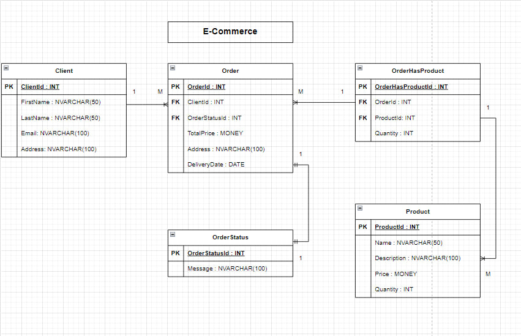

## Доменная область: ECommerce (интернет продажа).

---

## Описание

Есть 5 сущностей:

- клиент

- заказ

- статус заказа

- товар

- товар в заказе

### Клиент - Client

Имеет поля: ClientId (PK), имя, фамилия, email и адрес.

### Заказ - Order

Имеет поля: OrderId (PK), OrderStatus (FK), дата доставки, адрес доставки, полная стоимость заказа.

### Статус Заказа - OrderStatus

Имеет поля: StatusId (PK), сообщение.

### Товар - Product

Имеет поля: ProductId (PK), название, описание, цена за шт, количество.

### Товар в Заказе - OrderHasProduct

Имеет поля: OrderHasProductId (PK), OrderId (FK), ProductId (FK), количество (сколько шт одного товара заказано).

## Связи

У одного клиента может быть много заказов (1 to Many).
У одного заказа может быть один статус заказа (1 to 1).
Один заказ может быть во многих [ТоварВЗаказе] (1 to Many).
Один товар может быть во многих [ТоварВЗаказе] (1 to Many).
