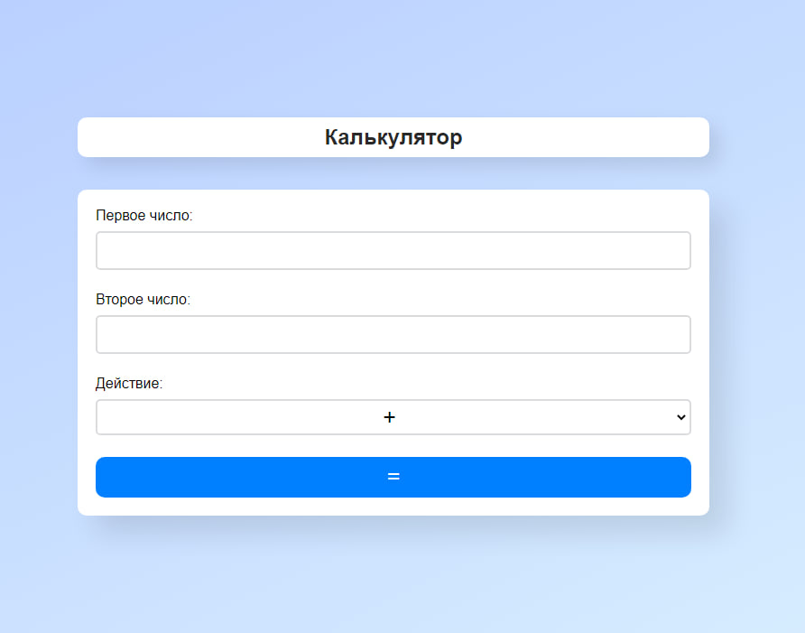
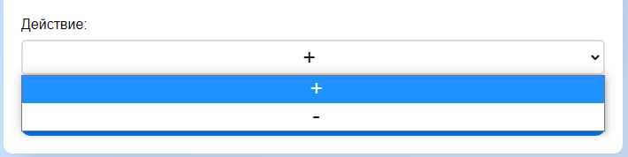
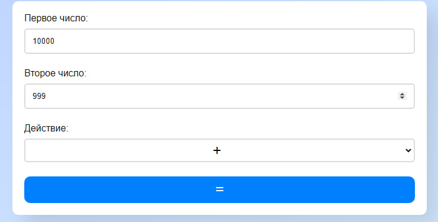
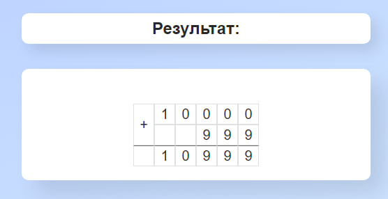
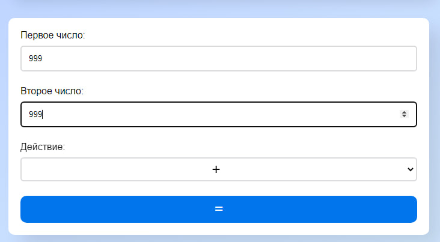
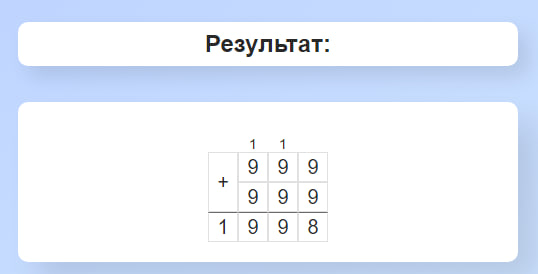
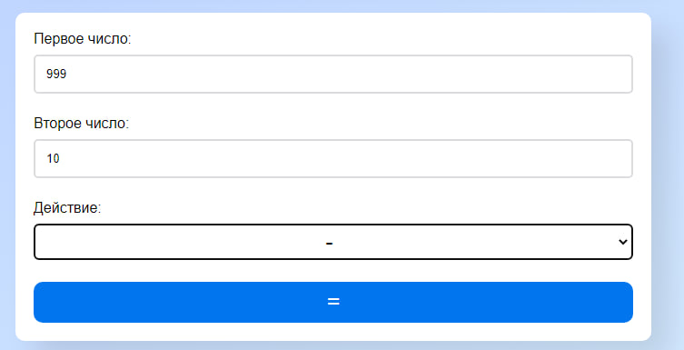
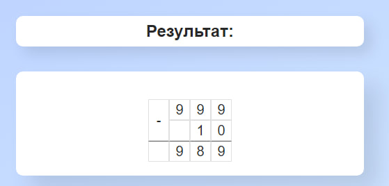
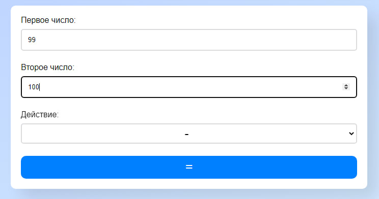
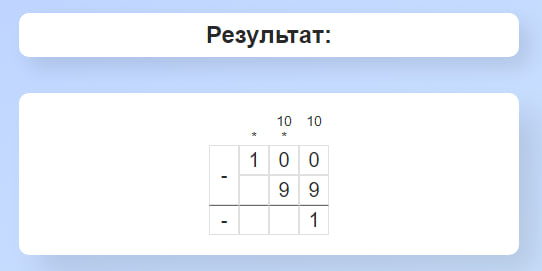

## Swagger 2.0.

---

### Дизайн - Главная страница.

### Окно селекта

Пока что только сложение и вычитание.

### Сложение - default case

Входные данные:

Результат:

### Сложение - complex case

Входные данные:

Результат:

### Вычитание - default case

Входные данные:

Результат:

### Вычитание - complex case

Входные данные:

Результат:

