## Swagger 2.0.

---

### Дизайн (кусочек) - Главная страница.

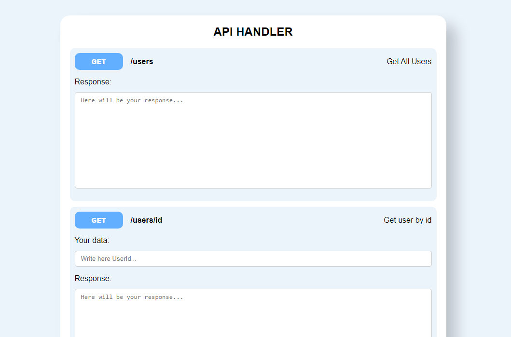

### Создание пользователя

Входные данные:

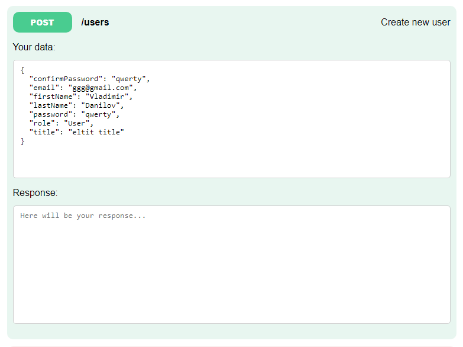

Результат:

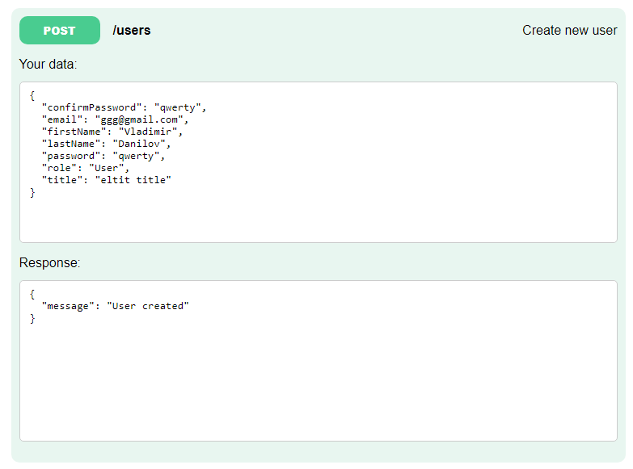

### Получение одного пользователя

Входные данные:

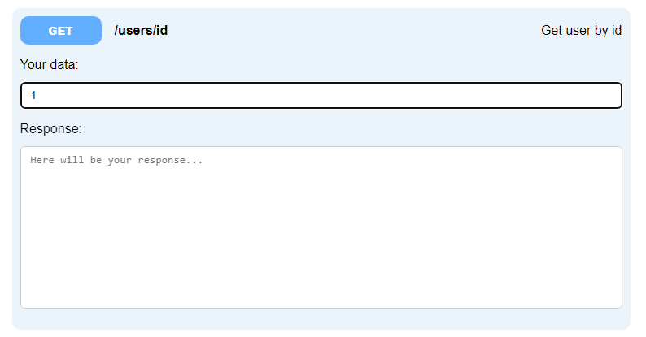

Результат:

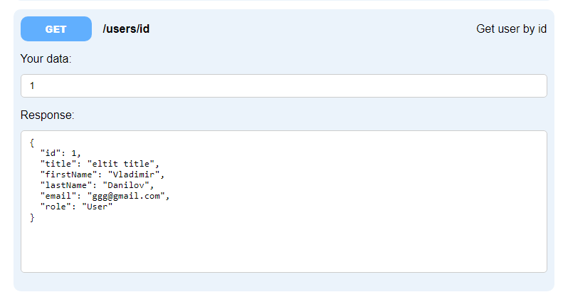

### Получение всех пользователей

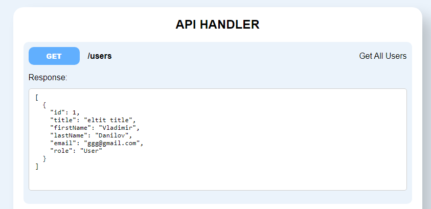

### Изменение пользователя

Входные данные:

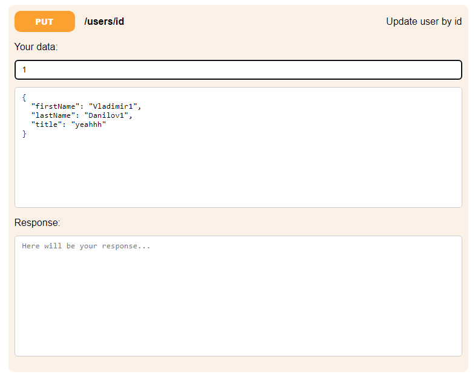

Результат:

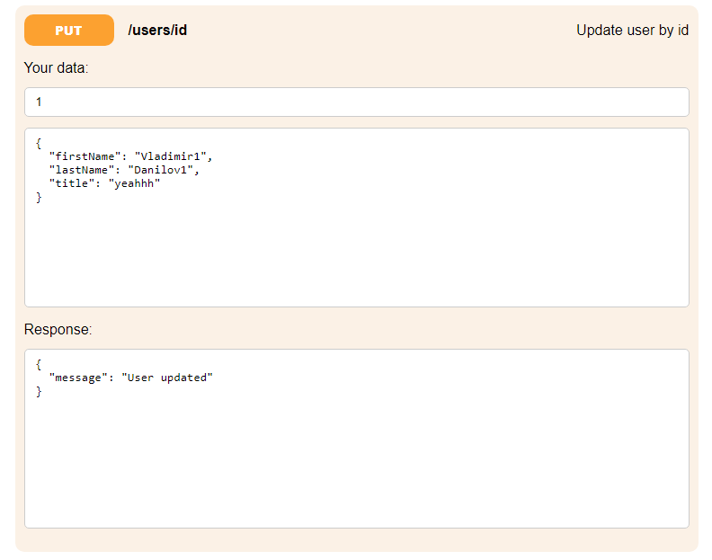

Обновленный пользователь:

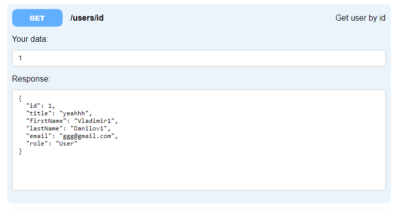

### Удаление пользователя

Входные данные:

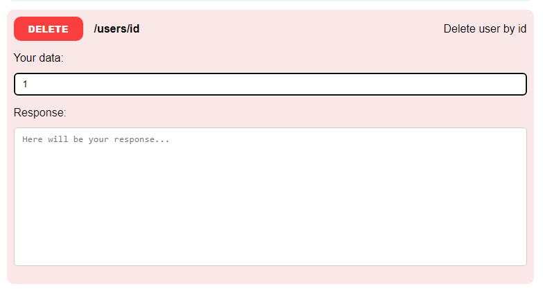

Результат:

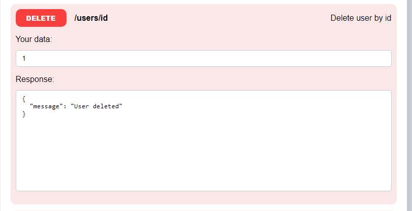

Проверка всех пользователей:

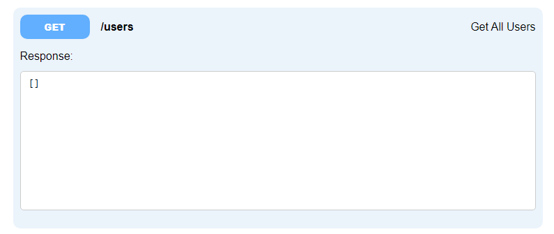
