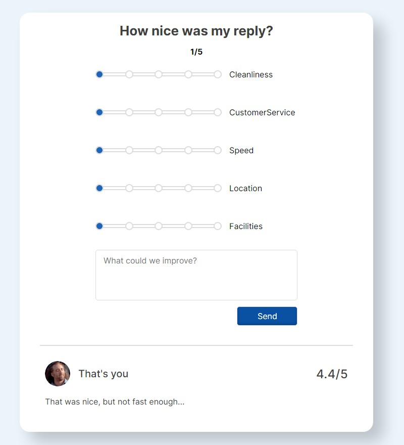

## Форма отзывов.

---

### Дизайн (сделал чуточку ровнее, чем на макете).

Перед отправкой:

После отправки:

### Сделал форму готовой к масштабируемости.

Добавить новый range-input можно всего лишь двумя строчками, не трогая при этом сам UI.

Добавляем новую характеристику в Rating и в массиве с константными значениями ставим объект с key(можно ставить только
то, что существует в Rating) и label - то, что написано справа от инпута.

#### Результат:

Легко масштабируемое приложение.

