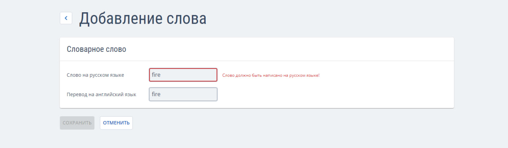

## Тренажёр иностранных слов (базовый функционал + zustand).

---

### Стартовая страница (HomePage).

### Словарь:

Пустой:

Заполненный

### Добавление слова:

Валидация на корректные значения инпутов:

Когда все поля корректно заполнены, кнопка "Сохранить" становится активной.

### Редактирование слов.

Так же присутствует валидация.

### Проверка знаний (QuizPage):

Если в словаре пользователя меньше 4 слов, то нельзя пройти проверку.

Начало (Кнопка проверить неактивна до того момента, как будет выбрано слово):

После выбора:

#### После нажатия на кнопку проверить показывается проверка слова и появляется кнопка перейти к следующему слову:

- Слово прошло проверку, ответ пользователя верен.

- Слово не прошло проверку, ответ пользователя неверен.

Так же по нажатию на кнопку проверить становится невозможным изменить свой ответ на вопрос.

#### Финальный вопрос:

#### Страница с результатом:

